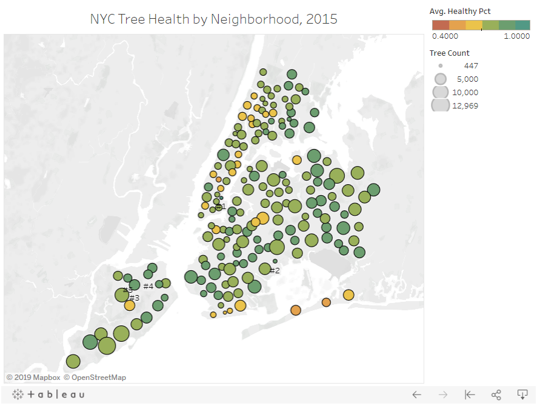
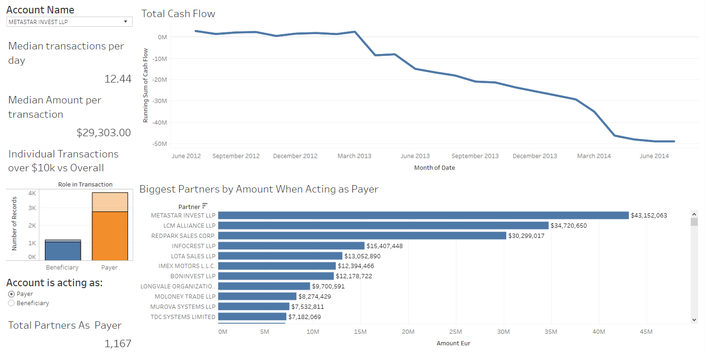
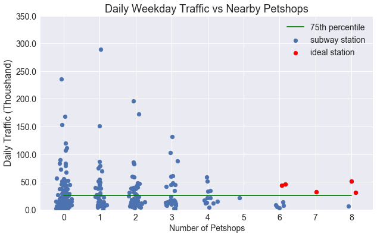

# Project Portfolio

# 1. Analytics Reports

## 1.1 Mapping NYC Neighborhood Trees

    
    Objective: Visualize how tree health and population have evolved in different NYC neighborhoods
    Data: Tree census data containing 600k rows 
    Tools Used: SQL, Pandas, Seaborn, Google BigQuery, Tableau
    Results: Tableau map with neighborhoods color coded by tree health and sized by total count 

## 1.2 Trending Google Analytics KPIs
[Analysis](https://www.kaggle.com/douglasl/ga-bigquery-ecommerce-analysis-2)

    Objective: Answer marketing questions for an ecommerce site 
    Data: Google Merchandise Store's web traffic data from 900k sessions  
    Tools Used: SQL, Seaborn, Google BigQuery
    Results: Identified top 3 channels for enerating revenue and calculated simplified Return on Ad Spend (ROAS) for Paid Search

## 1.3 Detecting Money Laundering 

    Objective: Provide a quick summary of a specified bank account's activities
    Data: 16940 bank transactions from Azerbaijani investigation
    Tools Used: SQL, Tableau
    Results: Interactive Tableau dashboard to display attributes such as frequent transactions, account cashflow, and major transaction partners
Source: [Azerbaijani Laundromat](https://www.occrp.org/en/azerbaijanilaundromat/)

## 1.4 Coffee Meets Cats

    Objective: Look for locations conductive to a new cat cafe 
    Data: MTA turnstiles, MTA station locations, NYC business inspections
    Tools Used: Pandas, Matplotlib
    Results: Found top 5 candidate locations, with high amounts of both foot traffic and pet stores

## 1.5 Farmer Market Sales

    Objective: Create accessible report on market sales trends 
    Data: Square POS transactions, manually entry transactions
    Tools Used: Pandas, Plotly, Dash, Excel
    Results: Web app displaying quantity sold of select items, both as a table and as a scatter plot 

<!-- ## 1.6 Instacart Market Basket Analysis
    Objective: 
    Data: 
    Tools Used: 
    Results: 

# 2. Natural Language Processing 

## 2.1 [Project Owl] Parsing Emergency Help Requests
    Objective: 
    Data: 
    Tools Used: 
    Results: 

## 2.2 Recommending Journal Articles 
    Objective: 
    Data: 28k scraped journal abstracts 
    Tools Used: Scrapy, Pandas, SK-learn, Tableau
    Results: 

## 2.3 Classfiying Insincere Questions 
    Objective: 
    Data: 
    Tools Used: 
    Results: 

## 2.4 Unbiasing Toxic Comments 
    Objective: 
    Data: 
    Tools Used: 
    Results: 

# 3. Machine Learning 

## 3.1 Predicting Wildfire Size
    Objective: 
    Data: 
    Tools Used: 
    Results: 

## 3.2 Pasture Snap
    Objective: 
    Data: 
    Tools Used: 
    Results:  -->