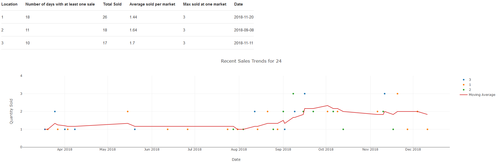

# Project Portfolio

# 1. Analytics Reports

## 1.1 Mapping NYC Neighborhood Trees

    
    Objective: Visualize how tree health and population have evolved in different NYC neighborhoods
    Data: Tree census data containing 600k rows 
    Tools Used: SQL, Pandas, Seaborn, Google BigQuery, Tableau
    Results: Tableau map with neighborhoods color coded by tree health and sized by total count 

## 1.2 Trending Google Analytics KPIs
[Analysis](https://www.kaggle.com/douglasl/ga-bigquery-ecommerce-analysis-2)

    Objective: Answer marketing questions for an ecommerce site 
    Data: Google Merchandise Store's web traffic data from 900k sessions  
    Tools Used: SQL, Seaborn, Google BigQuery
    Results: Identified top 3 channels for enerating revenue and calculated simplified Return on Ad Spend (ROAS) for Paid Search

## 1.3 Detecting Money Laundering 

### 1.3.1 Dashboard

    Objective: Provide a quick summary of a specified bank account's activities
    Data: 16940 bank transactions from Azerbaijani investigation
    Tools Used: SQL, Tableau
    Results: Interactive Tableau dashboard to display attributes such as frequent transactions, account cashflow, and major transaction partners

### 1.3.2. Report 
    Objective: Detailed report on suspected money laudnering patterns
    Data: 16940 bank transactions from Azerbaijani investigation
    Tools Used: Pandas, Plotly, SQL
    Results: Presentation with business context and implications, trends with visualizations, recommended actions, and proposed automated solution for recurrence prevention

Source: [Azerbaijani Laundromat](https://www.occrp.org/en/azerbaijanilaundromat/)

## 1.4 Coffee Meets Cats

    Objective: Look for locations conductive to a new cat cafe 
    Data: MTA turnstiles, MTA station locations, NYC business inspections
    Tools Used: Pandas, Matplotlib
    Results: Found top 5 candidate locations, with high amounts of both foot traffic and pet stores

## 1.5 Farmer Market Sales

    Objective: Create accessible report on market sales trends 
    Data: Square POS transactions, manually entry transactions
    Tools Used: Pandas, Plotly, Dash, Excel
    Results: Web app displaying quantity sold of select items, both as a table and as a scatter plot 
<!-- 
## 1.6 Instacart Market Basket Analysis
    Objective: 
    Data: 
    Tools Used: 
    Results:  -->

# 2. Natural Language Processing 

## 2.1 [Project Owl] Parsing Emergency Help Requests
    Objective: Highlight details from help requests to aid rescue
### 2.1.1 Hurricane Harvey Tweets and Terms
    Objective: Familiarize with format and keywords used in help requests
    Data: Multiple data sources (tweets, term-category pairs)
    Tools Used: Pandas, tweet-preprocessor, spacy
    Results: Lists of keywords sorted in broad categories 
    

## 2.2 Recommending Journal Articles 
    Objective: Recommend smilar articles based on cosine/Euclidean distance between bag-of-words representations
    Data: 28k scraped journal abstracts From Journal of Animal Science
    Tools Used: Scrapy, Pandas, SK-learn, Tableau
    Results: Flask application taking the text of an abstract and returning its most similar articles, with optional keyword filter for results
[Github](https://github.com/Douglas-L/Journal_Article_Recommendations)
### 2.2.1 Topic Modeling Over Time
    Objective: Visualize how trends in journal topics have changed over time
    Tools Used: Tableau, Sklearn 
    Results: Interactive Tableau visualization, highlighting the rise of feedlot and genetics research in animal science 

## 2.3 Classfiying Insincere Questions 
    Objective: Classify question insincerity, encompassing toxicity and/or low effort, based only on the text
    Data: 1.3 million Quora questions with labeled classes
    Tools Used: Pandas, Keras, Spacy, pretrained word embeddings (GloVe) 
    Results: Recurrent neural network model with minimal text preprocessing
    and presentation at Kaggle NYC Meetup group

<!-- ## 2.4 Unbiasing Toxic Comments 
    Objective: 
    Data: 
    Tools Used: 
    Results:  -->

# 3. Machine Learning 

## 3.1 Predicting Wildfire Size
    Objective: Predict wildfire size based on featues known at the time of discovery to organize appropriate response 
    Data: 1.88 million wildfire records, corresponding US weather station data
    Tools Used: Pandas, Sklearn (Logistic Regression, Random Forest), Google BigQuery 
    Challenges: Highly imbalanced classes, missing data
    Results: Wildfire records joined to matching weather data and a classification model predicting final fire size 

## 3.2 Pasture Snap
    Objective: Quantify pasture quality by its composition 
    Data: Scraped plant images from Imagenet and Pl@ntnet, OpenSprayer
    Tools Used: Keras, skimage, NumPy, Flask, D3
    Results:  Flask app serving convolutional neural network model that outputs class percentages of the pasture composition 